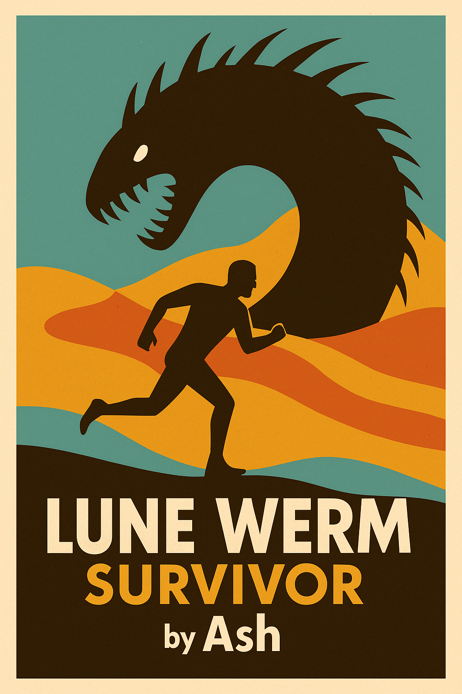

# Lune Werm: Survivor

<p align="center">
  
</p>


## Overview

**Lune Werm: Survivor** is a desert survival game built with Pygame. Guide your lone survivor through shifting dunes, collect scarce water, and avoid the subterranean Werms that stalk beneath the sands.

## Features

- **Procedurally placed** rocks, water caches, and villages  
- **Dynamic Werm AI** that steers around obstacles to hunt you  
- **Stamina bar**: collect water to replenish, rest in villages to slowly regen  
- **Zooming camera**: mouse wheel to zoom in/out on the world  

## Installation & Running

1. Clone the repo:
   ```bash
   git clone https://github.com/ashvernon/lune-werm-survivor.git
   cd lune-werm-survivor
(Optional) Create a virtualenv and install Pygame:


python -m venv venv
venv\Scripts\activate     # Windows
pip install pygame
Run the game:


python main.py
Controls
Arrow keys to move

Mouse wheel to zoom in/out

Collect blue water caches to refill stamina

Visit villages for slow stamina regen

Avoid the Werms—if they touch you, it’s Game Over!

Press R when “Game Over” to restart

License
Feel free to fork and experiment — this project is released under the MIT License.
